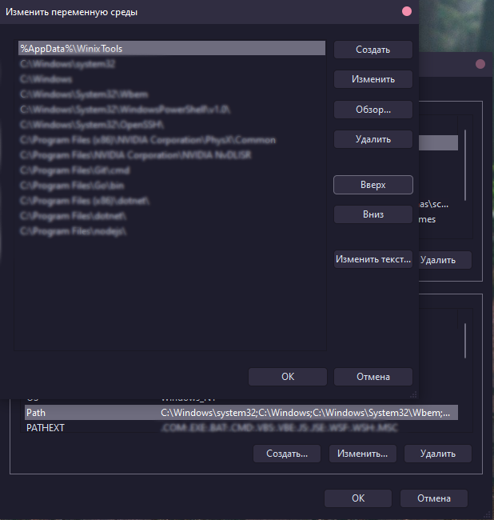
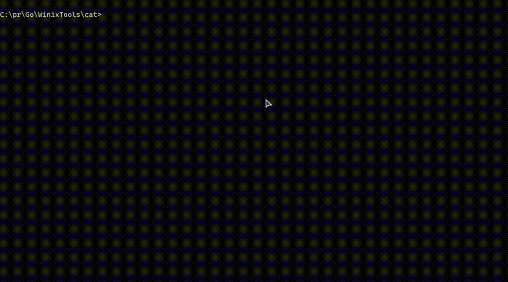

### WINIXTOOLS

#### List of unix utilities for Windows


#### Utilities

| NAME        | VERSION    |  TESTED     |
| ----------- | -----------| ----- |
| **ls**      | **1.0**    |  :heavy_check_mark:
| **ll**      | **1.0**    |  :heavy_check_mark:
| **cat**     | **1.0**    |  :heavy_check_mark:
| **clear**   | **1.0**    |  :heavy_check_mark:
| **[make](https://www.gnu.org/software/make/)**   | **1.0**    |  :heavy_check_mark:

### How to install

1) Open CMD at the **application folder**

2) Put this script to CMD
```powershell
mkdir %AppData%\WinixTools 
copy Tools\* %AppData%\WinixTools
SET path=%AppData%\WinixTools;%path%
```

or start `start.bat` file 

3) **CMD &rarr; Always run as Administrator**
4) **Changing System Environment Variables &rarr; Environment settings &rarr; System variables &rarr; Path &rarr; Edit... &rarr; Create &rarr; `%AppData%\WinixTools`**


   
  P.s `%AppData%` it's equal `C:\Users\%username%\AppData\Roaming`


5) Restart CMD
6) All ready to go!

### DEMO

<details>
<summary> <code>ls</code> &rarr; <b>show files in the directory</b></summary> <br>
 
</details>
<br>
<details>
<summary> <code>ll</code> &rarr; <b>show files in the directory & their rights</b></summary> <br>
 
</details>
<br>
<details>
<summary> <code>cat</code> &rarr; <b>read file from CMD</b></summary> <br>
 
</details>
<br>
<details>
<summary> <code>clear</code> &rarr; <b>clear CMD screen</b></summary> <br>
 
</details>
<br>
<details>
<summary> <code>make</code> &rarr; <b>start Makefile scripts</b></summary> <br>
 
</details>
<br>

<p align="center">2022 © <a href="https://github.com/Avdushin" target="_blank">AVDUSHIN</a></p>